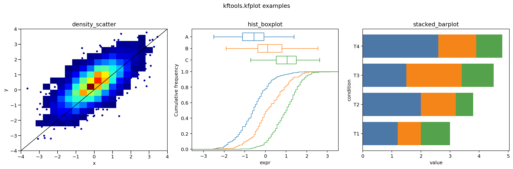

# Usage examples

Each Python block is self-contained. See [data semantics](data-semantics.md) for
defaults and missing-value rules, and [file formats](file-formats.md) for an OU
file example.

## Expression specificity

Calculate the standard tissue-specificity tau index from **raw expression**.
The explicit flags avoid the default log2 back-transformation:

```python
import numpy as np
import pandas as pd

from kftools.kfexpression import calc_tau

expression = pd.DataFrame(
    {
        "leaf": [10.0, 5.0],
        "root": [0.0, 5.0],
    }
)
tau = calc_tau(expression, ["leaf", "root"], unlog2=False, unPlus1=False)
np.testing.assert_allclose(tau, [1.0, 0.0])

# Default flags are appropriate when input is log2(expression + 1).
logged_expression = np.log2(expression + 1)
np.testing.assert_allclose(calc_tau(logged_expression, ["leaf", "root"]), tau)
```

## Trees

Read and inspect a phylogenetic tree:

```python
from kftools.kfphylo import check_ultrametric, get_tree_height

tree = "((A:1,B:1):2,C:3);"
assert check_ultrametric(tree)
assert get_tree_height(tree) == 3.0
```

## Species labels

Select taxonomic parsing explicitly to retain the subspecies. Default legacy
parsing would keep only `Bacillus_subtilis`:

```python
from kftools.kfspecies import parse_species_label

species = parse_species_label(
    "Bacillus_subtilis_subsp_168_gene3",
    species_parser="taxonomic",
)
assert species.scientific_name == "Bacillus subtilis subsp. 168"
assert species.taxonomy_query == "Bacillus subtilis"
assert parse_species_label("Bacillus_subtilis_subsp_168_gene3").species_label == "Bacillus_subtilis"
```

## Repeated ancestor queries

Prepare a lookup once when many nearest-ancestor queries use the same table:

```python
import pandas as pd

from kftools.kfog import prepare_most_recent_lookup

branch_table = pd.DataFrame(
    {
        "orthogroup": ["og1", "og1"],
        "branch_id": [0, 1],
        "parent": [1, 1],
        "is_shift": [0, 1],
        "regime": [0, 1],
    }
)
lookup = prepare_most_recent_lookup(
    branch_table,
    target_col="is_shift",
    return_col="regime",
)
regime = lookup.find(0, "og1", target_value=1)
assert regime == 1
assert lookup.find(1, "og1", target_value=1) == 1  # Includes the starting node.
```

## Sequence frequencies

Convert codon frequencies to per-position F3X4 frequencies, then theta values:

```python
from kftools.kfseq import codon2nuc_freqs, get_mapnh_thetas, nuc_freq2theta

codons = {"AAA": 0.25, "TTT": 0.25, "CCC": 0.25, "GGG": 0.25}
frequencies = codon2nuc_freqs(codons, model="GY+F3X4")
thetas = nuc_freq2theta(frequencies)
assert thetas == [{"theta": 0.5, "theta1": 0.5, "theta2": 0.5}] * 3
model_parameters = get_mapnh_thetas("GY+F3X4", thetas)
assert model_parameters.startswith("F3X4(1_Full.theta=0.5,")
```

For FASTA input, `alignment2nuc_freqs` supports only ungapped, unambiguous F3X4
sequences. See [FASTA requirements](file-formats.md#fasta).

## Brunner–Munzel test

Use overlapping samples with at least two finite observations each:

```python
import numpy as np

from kftools.kfstat import bm_test, brunner_munzel_test

x, y = [1, 2, 3, 4], [2, 3, 4, 5]
statistic, dof, pvalue, probability, low, high = bm_test(x, y)
assert probability == 0.71875  # P(X < Y) + 0.5 * P(X = Y).
np.testing.assert_allclose(brunner_munzel_test(x, y), [statistic, pvalue])
```

## Regression and stacked bars

Select `method="ols"` for ordinary least squares; `ols_annotations` otherwise
defaults to median regression. This block writes `kftools-example.png` in the
current directory. For a headless session, set `MPLBACKEND=Agg` before running.

```python
import matplotlib.pyplot as plt
import numpy as np
import pandas as pd

from kftools.kfplot import ols_annotations, stacked_barplot

fig, axes = plt.subplots(1, 2, figsize=(9, 4), constrained_layout=True)
x, y = [1, 2, 3, 4], [1, 3, 2, 5]
axes[0].scatter(x, y)
ols_annotations(x, y, ax=axes[0], method="ols", stats=["N", "rsquared", "rsquared_adj"])
axes[0].set(xlabel="Predictor", ylabel="Response", title="Ordinary least squares")

components = pd.DataFrame({"group": ["A", "A", "B", "B"], "first": [10, 20, 3, 5], "second": [10, np.nan, -2, -4]})
stacked_barplot("group", ["first", "second"], components, colors=["#4078A8", "#D9904A"], ax=axes[1])
axes[1].set(xlabel="Group", ylabel="Component mean", title="Means with missing and signed values")
axes[1].axhline(0, color="black", linewidth=0.6)
fig.savefig("kftools-example.png", dpi=150)
plt.close(fig)
```

Group A has heights 15 and 10 (total 25); group B has 4 above zero and -3 below.
Other plotting examples (`density_scatter`, `hist_boxplot`, `stacked_barplot`):


